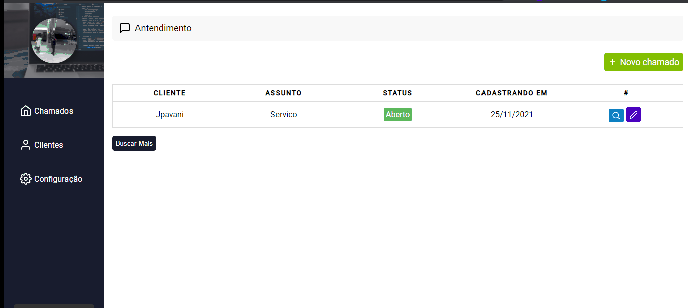
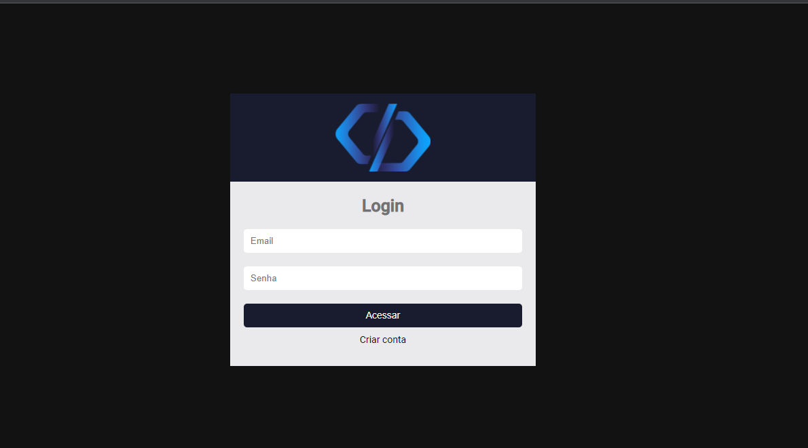
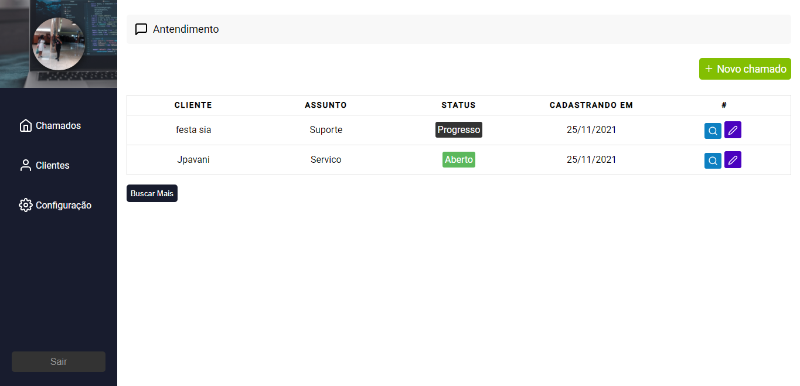
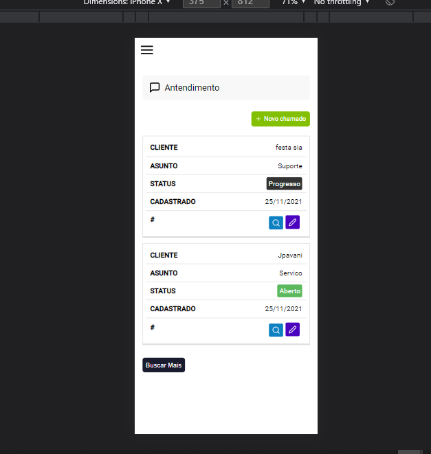

<h1 align='center'>Aplicação para cadastrar Serviços</h1>

No mobile

 

## Como usar

Pode clona o projeto e na raiz (pasta raiz) dá um npm start caso tenha o node-js instalado

## Tech Usadas
<li> React-js</li>
<li> Hooks</li>
<li> Context API</li>
<li> React-router-dom</li>
<li> Firebase</li>